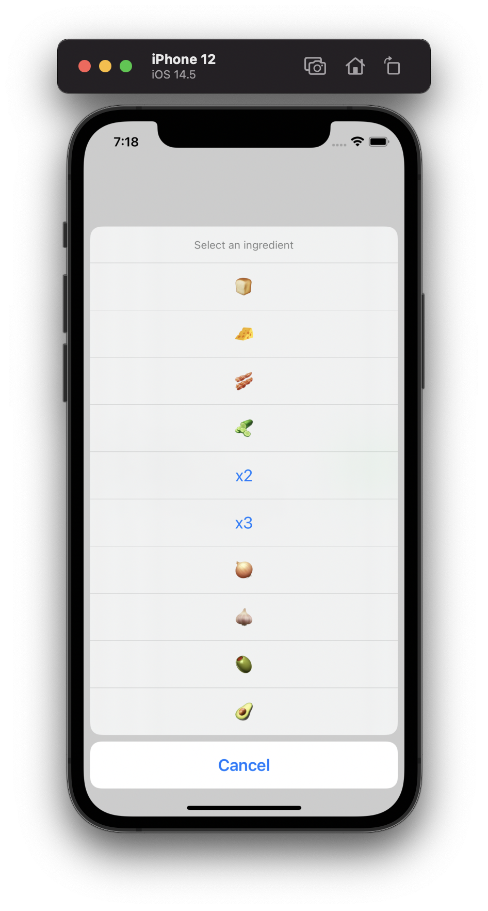

# Result Builder Example

An example project for [Using result builders for action sheets in SwiftUI](https://artemnovichkov.com/blog/result-builders) article.

  

## Author

Artem Novichkov, https://www.artemnovichkov.com/about

## License

The project is available under the MIT license. See the [LICENSE](./LICENSE) file for more info.
